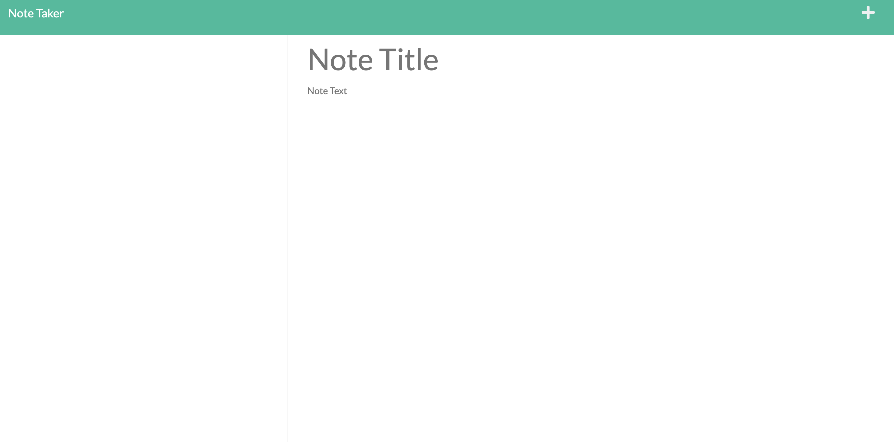
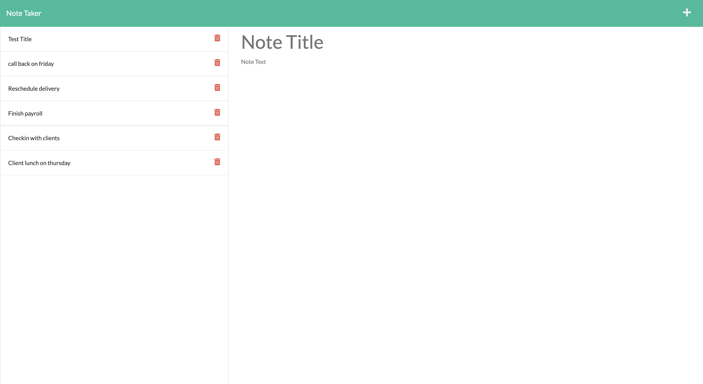
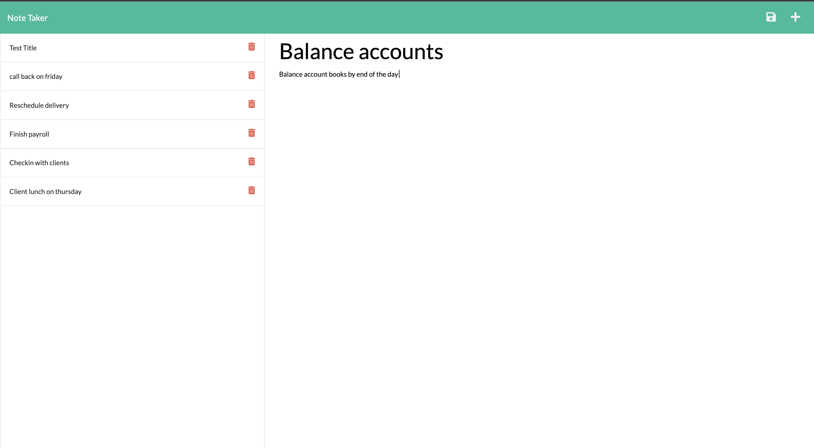

# Note-Taker

## License
# KeyGen 2.0 

## Description
This application was created to generate a high-quality, professional Note Taker base on a series of notes user enter on the right side, and it will safe and indicate on the leftside. This application use Express.js in their local machine.

## Table of Contents
- [Installation](https://github.com/collzbaba#Installation)
- [Usage](https://github.com/collzbaba#Usage)
- [Test](https://github.com/collzbaba#Test)
- [screenshots](https://github.com/collzbaba#screenshots)
- [Questions](https://github.com/collzbaba#Questions)
- [Deployed-Application](https://github.com/collzbaba#Deployed-Application)

## Installation
The user should clone the repository from GitHub and download Node.js. This application also requires to npm install node_modules, package-lock.json, and npm install express

## Usage
GIVEN a note-taking application
WHEN I open the Note Taker
THEN I am presented with a landing page with a link to a notes page
WHEN I click on the link to the notes page
THEN I am presented with a page with existing notes listed in the left-hand column, plus empty fields to enter a new note title and the note’s text in the right-hand column
WHEN I enter a new note title and the note’s text
THEN a Save icon appears in the navigation at the top of the page
WHEN I click on the Save icon
THEN the new note I have entered is saved and appears in the left-hand column with the other existing notes
WHEN I click on an existing note in the list in the left-hand column
THEN that note appears in the right-hand column
WHEN I click on the Write icon in the navigation at the top of the page
THEN I am presented with empty fields to enter a new note title and the note’s text in the right-hand column

## ScreenShot

## Questions
### GitHub:
https://github.com/collzbaba

### Contact Me:
If you have any additional questions, email me at: collzbadodo@gmail.com

## Deployed-Application
https://blessed-note-taker.herokuapp.com/notes

